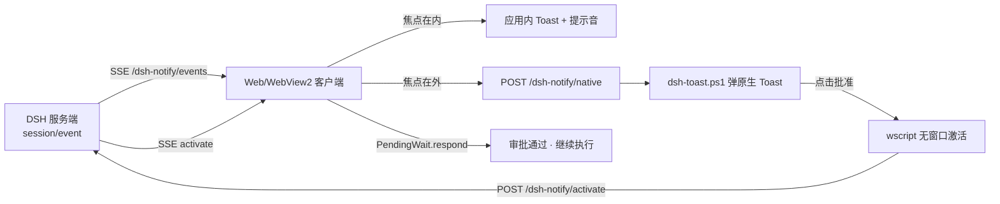

<div align="center">

# 🔔 dsh-notify

**DeepSeek Harness 通用通知插件** — 新会话 / 待审批 / 任务完成 / 任务中断，一个都不错过。


</div>

---

## ✨ 特性

| | | |
|---|---|---|
| 🔔 **应用内通知**<br>焦点在 DSH 时，右上角弹出 Telegram 风格 Toast 并播放提示音 | 🪟 **Windows 原生通知**<br>焦点离开 DSH 时，由系统通知中心弹出，标题统一为 `DSH-<项目名>` | ✅ **一键审批**<br>通知栏直接点「批准」应答审批，DSH 自动回前台继续执行（VS Code 同款体验） |
| 🎛️ **设置面板**<br>Web UI 设置 → 通知：总开关、通道开关、场景开关 | 📋 **通知日志**<br>记录内容 + 本地时区时间（如 `GMT+8`），最多 100 条 | 🚀 **重启不刷屏**<br>首次加载仅播种基线，历史状态不会重复补通知 |

## 🚀 快速开始

### 打包安装

```powershell
# 在项目目录下打包
pnpm pack --pack-destination ..

# 安装到 DSH web profile
dsh plugin --profile web add dsh-notify-0.2.1.tgz
```

安装完成后**重启 DSH Web GUI** 生效（重启会中断当前会话，请先保存手头任务）。

### 使用

- 打开 **设置 → 通知** 管理开关、测试通知、查看日志
- 什么都不用配置即可开箱即用：焦点在内弹应用内通知 + 提示音，焦点在外弹系统通知
- 待审批时，Windows 通知栏直接点「批准」→ DSH 回到前台并继续执行

## 🧩 触发场景

| 场景 | 触发方式 | 通知内容 |
| --- | --- | --- |
| 新会话 | 会话列表出现非空会话 / 空白会话发出首条消息 | `DSH-<项目名>` · 新会话已创建 |
| 待审批 | 工具请求越权执行（`approval/asked`） | 批准 / 拒绝 按钮，通知栏可直点 |
| 待回答 / 计划审阅 | `question/requested`、plan-review | 「查看」按钮，点击回到会话 |
| 任务完成 | `turn/end` reason=`completed` | 任务完成 |
| 任务中断 / 失败 | `turn/end` reason=`aborted/error/interrupted` | 任务被中断 / 任务失败 |
| 后台任务 | `session/jobs` → `completed/killed/failed` | 后台任务完成 / 被中断 / 失败 |

## ⚙️ 设置面板

插件在 **DSH Web UI 设置 → 通知** 注册管理页：

- **总开关**：启用通知（关闭后不再发出任何通知，客户端 + 服务端双重拦截）
- **通道开关**：应用内通知 / 提示音 / 系统通知（失焦时）
- **场景开关**：新会话、待审批、待回答·计划审阅、任务完成、任务中断·失败、后台任务
- **测试按钮**：测试应用内通知、测试系统通知、测试审批通知
- **通知日志（已通知）**：内容 + 本地时区时间（如 `2026-08-23 22:45:01 GMT+8`），最多 100 条，可清空
- 设置通过 DSH 官方设置系统持久化（`ctx.settings` / `ctx.settingsScope`），与 Web UI 其他设置一致

## 🪟 通用性设计

Windows 原生通知**只依赖系统自带能力**，在任何 Windows 10 / 11 上都可运行：

- 纯 **PowerShell 5.1** + .NET Framework 内置 WinRT API（`Windows.UI.Notifications`）
- **只写 HKCU 注册表**（AUMID + 自定义协议 `dsh-notify://`），**不创建 .lnk**，不会被火绒等安全软件拦截，也无需管理员权限
- 点击 Toast 由 **wscript.exe（无控制台）+ VBS** 隐藏启动激活分支，**不闪 cmd/PowerShell 窗口**
- 无需 Windows App SDK、无需 .NET 运行时、无需安装任何 PowerShell 模块
- 服务端仅需 Node ≥ 20（DSH 自带），无第三方 npm 依赖（`schemastery` 除外）

## 🔧 工作原理



要点：

- 每个 Toast 按钮携带**独立一次性 nonce**（10 分钟有效），激活时服务端校验后经 SSE 回传，客户端用官方 `PendingWait.respond()` 应答审批——不触碰宿主内部表，完全走公开协议
- 多页面（浏览器 + 桌面壳）同时打开时按 `tag` 去重，批准动作只生效一次
- 纯浏览器使用同样支持全部功能；「带回前台」仅对桌面壳（DshDesktop / 标题含 DeepSeek Harness 的窗口）生效

## 📁 项目结构

```
dsh-notify/
├─ lib/index.js            # 服务端：路由 + SSE + 会话事件监听 + 原生通知触发
├─ lib/client.js           # 客户端：应用内 Toast + 音频 + 焦点检测 + 审批应答 + 设置页
├─ scripts/dsh-toast.ps1    # 通用 Windows 原生 Toast（PowerShell + WinRT）
├─ scripts/dsh-activate.vbs # 无窗口激活包装（wscript 隐藏启动）
├─ assets/notify.wav        # 自带提示音（合成，无版权）
├─ assets/dsh-notify.ico    # 通知图标（合成，无版权）
├─ tools/generate-audio.mjs # 重新生成提示音
├─ tools/generate-icon.mjs  # 重新生成图标
├─ cordis.patch.yml         # DSH bundle patch
└─ package.json
```

## 🛠️ 开发

```bash
# 重新生成提示音 / 图标
node tools/generate-audio.mjs
node tools/generate-icon.mjs

# 语法自检
node --check lib/index.js
node --check lib/client.js

# 打包
pnpm pack --pack-destination ..
```

## 📄 License

[MIT](LICENSE) © dsh-notify contributors