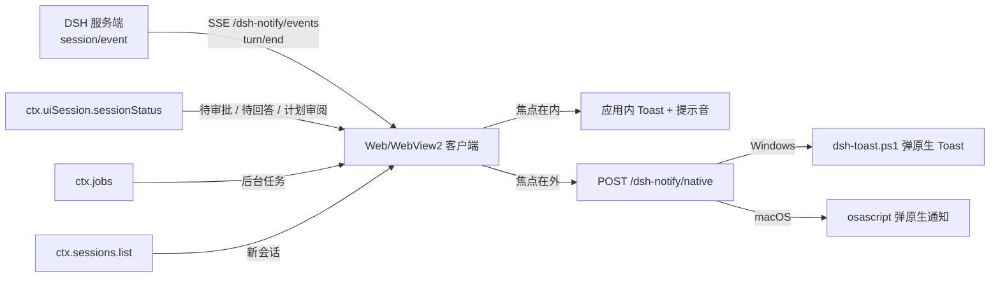

<div align="center">

# 🔔 dsh-notify
#Only Windows supported

**DeepSeek Harness 通用通知插件** — 新会话 / 待审批 / 任务完成 / 任务中断，一个都不错过。


</div>

---

## ✨ 特性

| | | |
|---|---|---|
| 🔔 **应用内通知**<br>焦点在 DSH 时，右上角弹出 Telegram 风格 Toast 并播放提示音 | 🪟 **Windows 原生通知**<br>焦点离开 DSH 时，由系统通知中心弹出（PowerShell + WinRT，无需管理员） | 🍎 **macOS 原生通知**<br>焦点离开 DSH 时，由 macOS 通知中心弹出（osascript，零依赖） |
| 🎛️ **设置面板**<br>Web UI 设置 → 通知：总开关、通道开关、场景开关 | 📋 **通知日志**<br>记录内容 + 本地时区时间（如 `GMT+8`），最多 100 条 | 🚀 **重启不刷屏**<br>首次加载仅播种基线，历史状态不会重复补通知 |
| 🤖 **子代理静音**<br>子代理会话不产生「新会话」「任务完成」通知，fan-out 工作流不会刷屏 | 📉 **任务订阅有界**<br>只订阅可能还有任务在跑的会话，不给全部历史会话开流 | ⚖️ **按需降级**<br>可选服务缺失时只关掉对应功能，插件本身永远能加载 |

> 原生通知**只负责提醒**，不做点击回调 / 一键审批 / 带回前台（已移除 wscript + VBS 激活链路，避免被 360 等安全软件误报为木马）。待审批请回到 DSH 界面，在应用内通知或审批面板中处理。

## 🚀 快速开始

### 打包安装

```powershell
# 在项目目录下打包
pnpm pack --pack-destination ..

# 安装到 DSH profile（新版桌面端是 desktop，旧版 Web 是 web）
dsh plugin --profile desktop add having5548-dsh-notify-0.5.0.tgz
```

安装完成后**重启 DSH Web GUI** 生效（重启会中断当前会话，请先保存手头任务）。

### 使用

- 打开 **设置 → 通知** 管理开关、测试通知、查看日志
- 什么都不用配置即可开箱即用：焦点在内弹应用内通知 + 提示音，焦点在外弹系统原生通知
- 待审批时：焦点在内会弹应用内通知（含批准 / 拒绝按钮）；焦点在外会收到系统原生通知提醒，回到 DSH 处理

## 🧩 触发场景

| 场景 | 触发方式 | 通知内容 |
| --- | --- | --- |
| 新会话 | 会话列表出现非空会话 / 空白会话发出首条消息（**子代理会话除外**） | `DSH-<项目名>` · 新会话已创建 |
| 待审批 | `ctx.uiSession.sessionStatus` 里该会话的 `pendingInteraction.kind === 'approval'` | 应用内通知含 批准 / 拒绝 按钮 |
| 待回答 / 计划审阅 | 同上，`kind` 为 `'question'` / `'plan-review'` | 「查看」按钮，点击回到会话 |
| 任务完成 | 服务端 `turn/end` reason=`completed`（**子代理会话除外**） | 任务完成 |
| 任务中断 / 失败 | 服务端 `turn/end` reason=`aborted/error/interrupted` | 任务被中断 / 任务失败 |
| 后台任务 | `ctx.jobs` 名册里该任务转为 `completed/killed/failed` | 后台任务完成 / 被中断 / 失败 |

## ⚙️ 设置面板

插件在 **DSH Web UI 设置 → 通知** 注册管理页：

- **总开关**：启用通知（关闭后不再发出任何通知，客户端 + 服务端双重拦截）
- **通道开关**：应用内通知 / 提示音 / 系统通知（失焦时）
- **场景开关**：新会话、待审批、待回答·计划审阅、任务完成、任务中断·失败、后台任务
- **测试按钮**：测试应用内通知、测试系统通知、测试审批通知
- **通知日志（已通知）**：内容 + 本地时区时间（如 `2026-08-23 22:45:01 GMT+8`），最多 100 条，可清空
- 设置通过 DSH 官方设置系统持久化：服务端以模块导出的 `Config` schema 声明，客户端经 `ctx.configForms.get('dsh-notify')` 读写，与 Web UI 其他设置一致

## 🖥️ 系统原生通知说明

### Windows 10 / 11

- 纯 **PowerShell 5.1** + .NET Framework 内置 WinRT API（`Windows.UI.Notifications`）
- **只写 HKCU 注册表**（AUMID），**不创建 .lnk**、**不注册自定义协议**、**不调用 wscript / VBS**，不会被 360 / 火绒等安全软件拦截，也无需管理员权限
- 通知仅含标题 + 正文，点击不会跳转、不会审批、不会带回前台

### macOS

- 通过系统自带的 `osascript` 调 `display notification`，走 macOS 通知中心，零第三方依赖
- 通知标题 = `DSH-<项目名>`，正文 = 事件内容；点击通知不会跳转（如需图标 / 跳转可后续接入 `terminal-notifier`）
- 首次使用时 macOS 可能提示是否允许「脚本编辑器 / osascript」发送通知，允许一次即可

## 🔧 工作原理


```mermaid
flowchart LR
    A[DSH 服务端<br/>session/event] -->|SSE /dsh-notify/events<br/>turn/end| B[Web/WebView2 客户端]
    P[ctx.uiSession.sessionStatus] -->|待审批 / 待回答 / 计划审阅| B
    J[ctx.jobs] -->|后台任务| B
    L[ctx.sessions.list] -->|新会话| B
    B -->|焦点在内| C[应用内 Toast + 提示音]
    B -->|焦点在外| D[POST /dsh-notify/native]
    D -->|Windows| E[dsh-toast.ps1 弹原生 Toast]
    D -->|macOS| F[osascript 弹原生通知]
```

要点：

- 服务端按运行平台自动选择通知通道：`win32` → PowerShell WinRT Toast；`darwin` → osascript；其他平台跳过
- 服务端 SSE 只推 `turn/end`；**待审批 / 待回答 / 计划审阅由客户端直接从 `ctx.uiSession.sessionStatus` 读取**——那是官方审批面板与侧边栏角标用的同一个事实源，服务端再广播一份只会造成一次审批弹两条通知
- 客户端只把 `sessions` / `slots` 放进 `inject`，其余服务（`configForms` / `uiSession` / `jobs` / `locale`）一律惰性解析：DSH 小版本升级常会改名或移除客户端服务，硬依赖会让整个插件停在 `pending`、连通知都发不出来。**宁可少一个功能，也不能整个插件不加载**
- 应用内通知的「批准 / 拒绝」按钮直接调用 `PendingApproval.answer('allowed-once' | 'rejected')`，不需要先打开会话；待办在别处被应答或取消后，对应 Toast 会自动撤掉
- **子代理会话被静音**：DSH 的子代理各自拥有独立会话（客户端 `SessionSummary.origin`、服务端 `session.header.origin` 均为 `'subagent'`），它们的每一轮都会 `turn/end`——一次 fan-out 工作流能刷出几十条通知。服务端在广播前就拦掉，「新会话」「任务完成」两侧也各自过滤。**审批 / 待回答不过滤**：漏掉一次授权的代价远大于多一条通知
- 后台任务名册是**按会话订阅**的（`ctx.jobs.watchRows`），每个订阅在服务端是一条常开的 `job.list` 流。插件只订阅「可能还有任务在跑」的会话：当前会话、正在运行的会话、12 小时内活跃过的会话、以及名册里当前仍有任务的会话，其余不订阅
- 应用内通知的「查看」按钮仅作用于当前页面（纯 JS），不涉及任何系统激活
- 多页面（浏览器 + 桌面壳）同时打开时按 `tag` 去重，避免重复通知

## 📁 项目结构

```
dsh-notify/
├─ lib/index.js            # 服务端：路由 + SSE + 会话事件监听 + 跨平台原生通知触发
├─ lib/client.js           # 客户端：应用内 Toast + 音频 + 焦点检测 + 审批应答 + 设置页
├─ scripts/dsh-toast.ps1    # Windows 原生 Toast（PowerShell + WinRT，纯通知无激活）
├─ assets/notify.wav        # 自带提示音（合成，无版权）
├─ assets/dsh-notify.ico    # 通知图标（合成，无版权）
├─ tools/generate-audio.mjs # 重新生成提示音
├─ tools/generate-icon.mjs  # 重新生成图标
├─ tools/smoke-client.mjs   # 客户端接线回归测试（打桩跑，无需浏览器）
├─ cordis.patch.yml         # DSH bundle patch
└─ package.json
```

## 🛠️ 开发

```bash
# 客户端接线回归测试（DSH 升级后必跑）
node tools/smoke-client.mjs

# 重新生成提示音 / 图标
node tools/generate-audio.mjs
node tools/generate-icon.mjs

# 语法自检
node --check lib/index.js
node --check lib/client.js

# 打包
pnpm pack --pack-destination ..
```

> **DSH 升级后请务必跑一遍 `tools/smoke-client.mjs`。** DSH 小版本之间会改名或移除客户端服务
> （0.1.5 → 0.1.7 就删掉了 `settingsScope`、把 `uiSession.pendingInteractions` 并进了
> `sessionStatus`、把 `jobsBySession` 搬到了 `ctx.jobs`）。插件的 `inject` 里只要有一个服务
> 不存在，cordis 就会让它在 `pending` 里一直等——**插件完全不加载，而且没有任何报错**。

## 📄 License

[MIT](LICENSE) © dsh-notify by having5548
